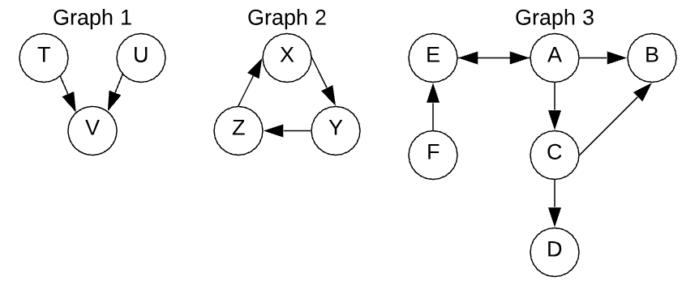
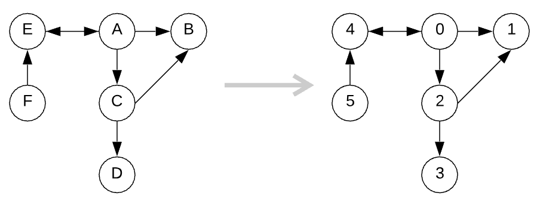

# **Graph Notes**

## **What is a Graph?**

* Graph lacks a root node
* Have cycels
* Have any number edges leaving a node


* Graph 1 does not have a root
* Graph 2 has a cycle
* Graph 3 have more than 2 edges

## **Graph Implementations**

#### GraphNode Class

```javascript
class GraphNode {
    constructor(val) {
        this.val = val;
        this.neighbors = [];
    }
}

let a = new GraphNode('a');
let b = new GraphNode('b');
let c = new GraphNode('c');
let d = new GraphNode('d');
let e = new GraphNode('e');
let f = new GraphNode('f');
a.neighbors = [b, c, e];
c.neighbors = [b, d];
e.neighbors = [a];
f.neighbors = [e];
```
* This way of representation does not provide easy way to represent the entire graph

#### Adjacency Matrix

* One way to represent the graph is through 2d matrix


```javascript
let matrix = [
/*          A       B       C       D       E       F   */
/*A*/    [true,  true,   true,   false,  true,   false],
/*B*/    [false, true,   false,  false,  false,  false],
/*C*/    [false, true,   true,   true,   false,  false],
/*D*/    [false, false,  false,  true,   false,  false],
/*E*/    [true,  false,  false,  false,  true,   false],
/*F*/    [false, false,  false,  false,  true,   true]
];
```

* Not space efficient
* Graph can be represented with the 2D array
* When the edges have direction, ```matrix[i][j]``` may not be the same as ```matrix[j][i]```
* It is common to say that a node is adjacent to itself, so ```matrix[x][x] === true``` for any ```x```

#### Adjancey List

* This way of representation uses an object where keys represent the node labels. 
    * The associated values of the keys are arrays containing all adjacent nodes

```javascript
let graph = {
    'a': ['b', 'c', 'e'],
    'b': [],
    'c': ['b', 'd'],
    'd': [],
    'e': ['a'],
    'f': ['e']
};
```

