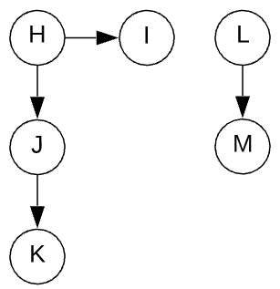

# **Graph Traversal Notes**

## **Depth-First w/ GraphNode**

* Key here is to keep track of the nodes that were visited, because graph might have a cycle

```javascript
class GraphNode {
    constructor(val) {
        this.val = val;
        this.neighbors = [];
    }
}

let a = new GraphNode('a');
let b = new GraphNode('b');
let c = new GraphNode('c');
let d = new GraphNode('d');
let e = new GraphNode('e');
let f = new GraphNode('f');
a.neighbors = [e, c, b];
c.neighbors = [b, d];
e.neighbors = [a];
f.neighbors = [e];

// Recursive Version
function depthFirstRecur(node, visited=new Set()) {
    // Use Set as it has constatnt time lookup
    // return early if visited
    if (visited.has(node.val)) return;

    console.log(node.val);
    visited.add(node.val);

    node.neighbors.forEach(neighbor => {
        depthFirstRecur(neighbor, visited);
    });
}

depthFirstRecur(f);

// Iterative Vversion
function depthFirstIter(node) {
    let visited = new Set();
    let stack = [ node ];

    while (stack.length) {
        let node = stack.pop();

        // skip if already visited using continue
        if (visited.has(node.val)) continue;

        console.log(node.val);
        visited.add(node.val);

        // then add its neighbors to the stack
        stack.push(...node.neighbors);
    }
}

depthFirstIter(f);
```

## **Graph Traversal w/ Adjacency List**

* Adventage of using an adjacency list is that it shows the entire graph

```javascript
let graph = {
    'a': ['b', 'c', 'e'],
    'b': [],
    'c': ['b', 'd'],
    'd': [],
    'e': ['a'],
    'f': ['e']
};

function depthFirstRecur(node, graph, visited=new Set()) {
    if (visited.has(node)) return;

    console.log(node);
    visited.add(node);

    graph[node].forEach(neighbor => {
        depthFirstRecur(neighbor, graph, visited);
    });
}

depthFirstRecur('f', graph);
```
* Above requires to initiate with correct starting node, thus not fully utilizing the adventage of using an adjacency list representation of the graph


```javascript
function depthFirst(graph) {
    let visited = new Set();

    for (let node in graph) {
        _depthFirstRecur(node, graph, visited);
    }
}

function _depthFirstRecur(node, graph, visited) {
    if (visited.has(node)) return;

    console.log(node);
    visited.add(node);

    graph[node].forEach(neighbor => {
        _depthFirstRecur(neighbor, graph, visited);
    });
}

depthFirst(graph);
```


* This is example of a single graph with trees, thus making it a forest!

```javascript
let graph = {
    'h': ['i', 'j'],
    'i': [],
    'j': ['k'],
    'k': [],
    'l': ['m'],
    'm': []
}

depthFirst(graph);
// prints h, i, j, k, l, m
```