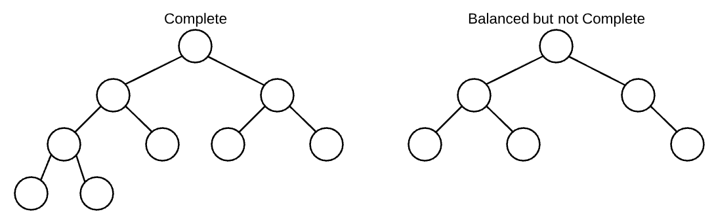

# **Heaps Notes**
* Heap is useful to partially sort data 
    * ex) "Find the largest 5 numbers
    * has an O(n)
## **Max Heap**
* Given any node, its children must be less than or equal to the node

## **Complete Tree**
* Every complete tree is also a balanced tree, but not every balanced tress is complete
* Complete Tree is:
    * a tree where all levels have the maximal number of nodes, except the bottom level
    * the bottom level has all nodes filled as far left as possible



### **Implementation of Heap**
* Usually implemented by using an array
    * Each index of the array represents a node
    * **Avoid using the first index to keep the math simple**
        * index ```i``` represents a node in the heap
        * the left child of node ```i``` can be found at index ```2 * i```
        * the right child of code ```i``` can be found at index ```2 * i + 1```
        * the parent of node ```i``` can be found at index ```Math.floor(i / 2)```


* ```[null, 42, 32, 24, 30, 9, 20, 18, 2, 7]```

#### Insertion
* Inser to left most level until the level is filled
    * Then, check the value against the root node, and swap if it is beigger than the root value
* O(log n) - the worst case, it has to swap only through the height of the tree 

#### Deletion (deleteMax)
* Bring the right most lowest node and bring it to the top
    * this is to keep the tree complete and balanced
* Then swap with the largest value 
* O(log n) - the worst case, it has to swap only through the height of the tree 

#### Array Heapify 
* **Amortized** O(n) - perofrmance over many insertions

```javascript
class MaxHeap {
    constructor() {
        this.array = [null];
    }

    getParent(idx) {
        return Math.floor(idx / 2);
    }

    getLeftChild(idx) {
        return idx * 2;
    }

    getRightChild(idx) {
        return idx * 2 + 1;
    }

    insert(val) {
        this.array.push(val);
        this.siftUp(this.array.length - 1);
    }
    
    siftUp(idx) {
        if (idx === 1) return;
        
        let parentIdx = this.getParent(idx);

        if (this.array[parentIdx] < this.array[idx]) {
            [ this.array[parentIdx], this.array[idx] ] = [ this.array[idx], this.array[parentIdx] ];
            this.siftUp(parentIdx);
        }
    }

    deleteMax() {
        if (this.array.length === 2) return this.array.pop();
        if (this.array.length === 1) return null;

        let max = this.array[1];
        this.array[1] = this.array.pop();
        this.siftDown(1);
        return max;
    }

    siftDown(idx) {
        let ary = this.array;
        let leftIdx = this.getLeftChild(idx);
        let rightIdx = this.getRightChild(idx); 
        let leftVal = ary[leftIdx];
        let rightVal = ary[rightIdx];

        if (leftVal === undefined) leftVal = -Infinity;
        if (rightVal === undefined) rightVal = -Infinity;
    
        if (ary[idx] > leftVal && ary[idx] > rightVal) return;
    
        if (leftVal < rightVal) {
          var swapIdx = rightIdx;
        } else {
          var swapIdx = leftIdx;
        }
    
        [ ary[idx], ary[swapIdx] ] = [ ary[swapIdx], ary[idx] ];
        this.siftDown(swapIdx);
    }
}
```