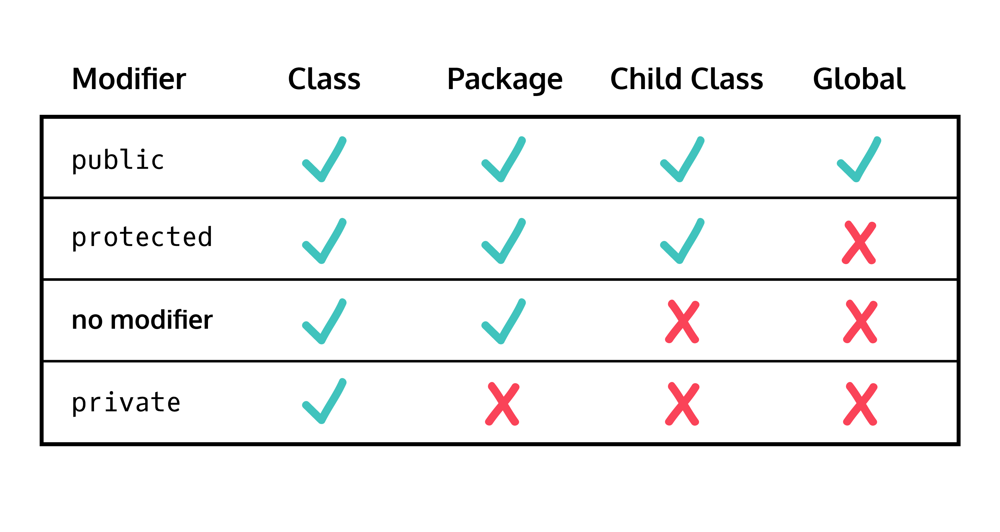

# Inheritance and Polymorphism
* Parent class, superclass, and base class - Class that other class inherits from
* Child class, subclass, and derived class - Class that inherits from other class

* Always run code using the file that contains the `main()` method
* Only one class in Java package needs a `main()` method

```java
// Noodle.java
class Noodle {
  
  double lengthInCentimeters;
  String shape;
  String texture = "brittle";
  
  public void cook() {
    
    this.texture = "cooked";
    
  }
  
  public static void main(String[] args) {
    Spaghetti spaghettiPomodoro = new Spaghetti();
    System.out.println(spaghettiPomodoro.texture);
  }
  
}

// Spaghetti.java
class Spaghetti extends Noodle  {
  
}
```

## Inheriting the Constructor
* Child classes inherit the parent constructor by default, but it's possible to modify the constructor using `super()` or override it completely

```java
// Noodle.java
class Noodle {
  
  double lengthInCentimeters;
  double widthInCentimeters;
  String shape;
  String ingredients;
  String texture = "brittle";
  
  Noodle(double lenInCent, double wthInCent, String shp, String ingr) {
    
    this.lengthInCentimeters = lenInCent;
    this.widthInCentimeters = wthInCent;
    this.shape = shp;
    this.ingredients = ingr;
    
  }
  
  public void cook() {
    
    this.texture = "cooked";
    
  }
  
  public static void main(String[] args) {
    Pho phoChay = new Pho();
    System.out.println(phoChay.shape);
    
    
  }
  
}

// Pho.java
class Pho extends Noodle {
  
  Pho() {
    super(30.0, 0.64, "flat", "rice flour");
  }
  
}
```
## Parent Class Aspect Modifiers

* Can add `final` before the modifiers to ensure that child class cannot modify the method
```java
  final public boolean isTasty() {
    
    return true;
    
  }
```